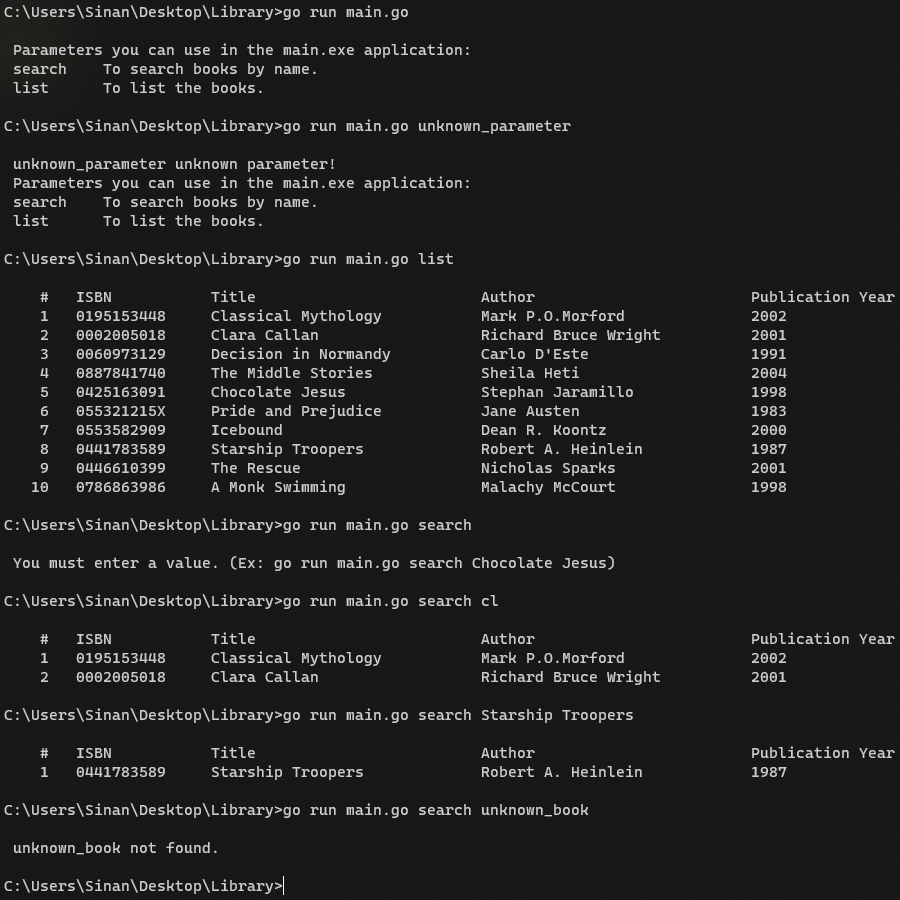

# Go Library App
  

A library application with search and listing features written in Go language.

### Project Structure

```properties
├── helper
│   └── cli.go
├── models
│   └── book.go
├── output
│   └── output.png
├── utils
│   ├── common.go
│   └── storage.go
└── main.go
```

### Usage
+ To list all books.
	
	```cmd
	go run main.go list
	```

+ To search within books by book name. You don't need to type the exact title of the book to search.
	
	```cmd
	go run main.go search book_title
	```
	
	```cmd
	go run main.go search boo
	```

+ Sample scenario of the application.

	
